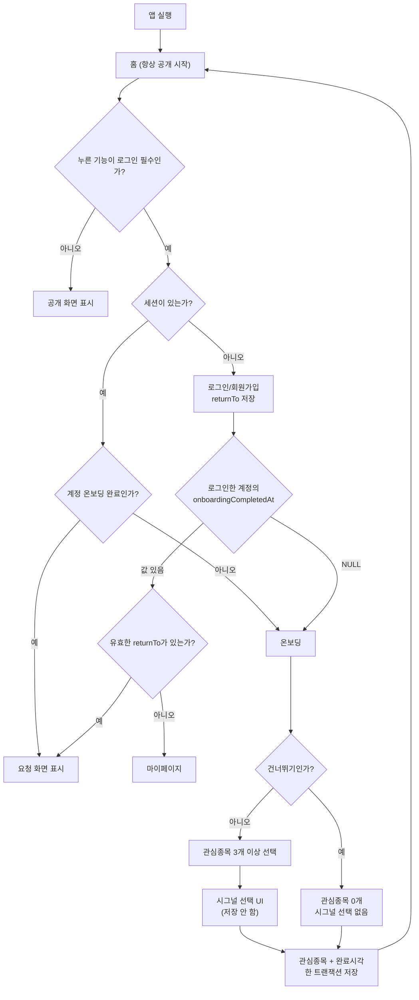

# RFC 0009 — 비로그인 접근 정책 · 로그인 복귀 · 계정 기반 온보딩 관심종목 저장 (guest-access-and-account-onboarding)

- 상태: **Draft**
- 작성일: 2026-07-30
- 범위:
  1. 비로그인 공개 영역과 로그인 필수 영역을 화면·API 양쪽에서 일치시킨다.
  2. 로그인 성공 후 기존 사용자는 원래 요청 화면으로, 요청 화면이 없으면 기존 팀장 구현대로 마이페이지로 보낸다.
  3. 신규 회원은 자동 로그인 후 온보딩을 거쳐 관심종목을 계정 DB에 저장하고 홈으로 보낸다.
  4. 온보딩의 시그널 종류 선택 UI는 유지하되 이번 범위에서는 저장·알림 반영하지 않는다.
- 제외: 이 문서는 **설계서만 작성**한다. 앱·서버·DB·마이그레이션 소스는 아직 변경하지 않는다.
- 기준 브랜치/코드: `all_in_one`의 2026-07-30 워킹트리
- 관련 문서:
  - `AGENTS.md`
  - `apps/native/CLAUDE.md`
  - `docs/internal/working-charter.md`
  - `docs/native/api/README.md`
  - `docs/native/api/plan.md`
  - `docs/native/api/discuss.md`
  - `docs/native/api/signals.md`
  - `docs/native/api/mypage.md`
  - `docs/adr/0002-implicit-membership.md`
  - `CONTEXT.md`
  - RFC 0004·0007·0008
  - [Better Auth — Email & Password](https://www.better-auth.com/docs/authentication/email-password)
  - [Drizzle Kit — generate](https://orm.drizzle.team/docs/drizzle-kit-generate)
  - [Drizzle Kit — migrate](https://orm.drizzle.team/docs/drizzle-kit-migrate)

---

## 0. 이번 RFC가 확정하는 사용자 요구

### 0-1. 앱 시작과 인증 후 이동

```text
앱 실행
→ 항상 홈

비로그인 상태에서 로그인 필수 기능 선택
→ 로그인/회원가입

기존 계정 로그인 성공
→ 원래 누른 화면
→ 원래 누른 화면이 없으면 마이페이지

신규 회원가입 성공
→ Better Auth 자동 로그인
→ 온보딩 소개
→ [정상 진행] 관심종목 3개 이상 선택
→ 시그널 종류 선택 UI(저장·실제 반영은 이번 범위 제외)
→ [건너뛰기] 관심종목 0개·시그널 선택 없음으로 완료
→ 선택한 관심종목이 있으면 계정 DB 저장
→ 계정 온보딩 완료 상태 DB 저장
→ 홈
```

### 0-2. 비로그인 공개 영역

| 영역 | 공개 범위 |
|---|---|
| 홈 | 홈 화면 전체 골격 |
| 시장 | 국내외 지수 |
| 시그널 | **홈의 공개 미리보기만** |
| 뉴스 | 홈 미리보기, 전체 뉴스, 시장·산업·기업·해외·정책 카테고리 |
| 토론 | 토론방 목록의 인기·최신, 선택한 방의 공개 shell(헤더·고정 토픽 등 메시지 외 정보) |
| 종목 | 종목 검색, 종목 상세의 시세·차트·기본 정보 |

### 0-3. 로그인 필수 영역

| 영역 | 로그인 필수 기능 |
|---|---|
| 시그널 | 시그널 전체 탭 |
| 토론 | 토론방 검색, 관심종목 탭, 즐겨찾기 탭, 토론방 메시지·답글·첨부 읽기 |
| 토론 동작 | 메시지 작성·답글·첨부, 방 좋아요·즐겨찾기 |
| 관심종목 | 관심종목 목록, 관심종목 뉴스·토론, 종목 관심 등록·해제 |
| 알림 | 알림함, 가격 알림 |
| 사용자 | 설정, 마이페이지 |

`화면 표시 관리`, `공유 및 친구 초대`처럼 현재 UI가 **“준비 중이에요”**만 보여주는 기능의 본 구현은 범위 밖이다. 다만 설정 영역 자체의 로그인 게이트는 위 정책에 맞춘다.

---

## 1. 배경과 현재 문제

현재 구현은 화면별로 인증 처리가 분산되어 있고, 클라이언트 가림과 서버 권한이 일치하지 않는 곳이 있다.

### 1-1. 로그인 성공 목적지가 하나로 고정되어 있다

`apps/native/src/screens/login/index.tsx`

```ts
const AFTER_LOGIN = "/(moneyroad)/(tabs)/mypage";
```

이 값은 기존 팀장 구현이며, 로그인과 회원가입 모두 세션이 생기면 마이페이지로 이동한다. 원래 사용자가 누른 보호 화면을 기억하지 않는다.

이 RFC는 팀장 구현을 폐기하지 않는다.

- `returnTo`가 있으면 기존 사용자는 원래 화면으로 이동한다.
- `returnTo`가 없으면 기존 값인 마이페이지를 그대로 기본값으로 쓴다.

### 1-2. 온보딩 완료 상태가 계정이 아니라 기기에 저장된다

현재 `apps/native/src/utils/onboarding.ts`는 `expo-secure-store`의 `mr.onboarded.v1` 값을 사용한다.

따라서 다음 문제가 생긴다.

- 같은 계정도 기기를 바꾸거나 앱 데이터를 지우면 온보딩이 다시 뜬다.
- 한 기기에서 다른 계정으로 로그인하면 이전 계정의 완료값을 공유한다.
- 서버는 사용자의 온보딩 완료 여부를 알 수 없다.
- 관심종목 선택은 `apps/native/src/utils/data.ts`의 mock 종목을 로컬 `Set`에 넣을 뿐 DB에 저장하지 않는다.

### 1-3. 앱 시작 순서가 요구와 반대다

- `apps/native/src/app/(moneyroad)/_layout.tsx`는 `onboarding`을 초기 라우트로 둔다.
- `apps/native/src/app/(moneyroad)/(tabs)/_layout.tsx`는 로컬 온보딩 값이 없으면 모든 탭에서 온보딩으로 리다이렉트한다.

요구사항은 **앱 실행 시 항상 홈**이고, 신규 회원의 가입 직후에만 필수 온보딩 흐름을 시작하는 것이다.

### 1-4. 토론방 메시지는 UI만 가리고 API는 공개다

현재:

- `discussion.messages`: `publicProcedure`
- `discussion.messagesAround`: `publicProcedure`
- `assertRoomReadable(null, roomId)`: 비로그인이면 즉시 통과
- native는 `GuestOverlay`로 메시지 위를 덮는다.

따라서 비로그인 사용자가 UI를 거치지 않고 RPC를 호출하면 메시지를 받을 수 있다. “토론방 메시지는 로그인 후 읽기” 정책은 반드시 서버에서 강제해야 한다.

### 1-5. 공개 미리보기와 전체 기능이 같은 API를 쓴다

시그널은 홈 미리보기는 공개지만 전체 탭은 로그인 필수다. 현재 `signal.feed`가 공개라 화면 라우트만 막아서는 API 수준에서 “미리보기만 공개”를 보장할 수 없다.

### 1-6. 보호 동작의 비로그인 처리 방식이 제각각이다

- `AuthGate` 사용
- 라우트에서 직접 `<Redirect href="/(moneyroad)/login" />`
- 화면 이벤트에서 아무 동작 없이 `return`
- “로그인이 필요합니다” 빈 화면만 표시

이 상태에서는 로그인 후 원래 화면 복귀, 신규회원 온보딩 분기, 외부 `returnTo` 차단을 한곳에서 보장하기 어렵다.

---

## 2. 목표와 비목표

### 2-1. 목표

- **G1** 공개·보호 영역을 위 정책표로 고정한다.
- **G2** 보호는 native 라우트뿐 아니라 oRPC/미디어 서버에서도 강제한다.
- **G3** 로그인 성공 후 안전한 내부 `returnTo`로 복귀한다.
- **G4** `returnTo`가 없을 때 기존 마이페이지 이동을 보존한다.
- **G5** 신규 계정만 온보딩 대상이 되며 기존 계정은 소급 온보딩하지 않는다.
- **G6** 정상 진행은 관심종목 3개 이상, 건너뛰기는 관심종목 0개로 완료하며 관심종목과 완료 상태를 한 DB 트랜잭션에서 저장한다.
- **G7** 앱을 삭제·재설치하거나 기기를 바꿔도 계정의 완료 상태가 유지된다.
- **G8** 기존 `watchlist`, `stock.search`, `AuthGate`, `nav`, Better Auth 세션, TanStack Query를 재사용한다.
- **G9** 시그널 종류 선택은 UI 상태만 유지하고 DB·푸시·알림 설정에는 반영하지 않는다.

### 2-2. 비목표

- 시그널 엔진 구현
- `tech`/`ai`/`event`/`community` 선택값 저장
- 매수/매도/관망 알림 설정 구현
- 커뮤니티 시그널 구현
- “준비 중이에요” 화면의 실제 기능 구현
- 로그인 후 사용자가 누른 좋아요·즐겨찾기·가격알림 동작 자동 재실행
- 인증 방식, 비밀번호 정책, Better Auth 공급자 변경
- 새 Expo/서버 패키지 설치
- realtime 또는 푸시 알림 변경

---

## 3. 정책 충돌 정리

### 3-1. ADR 0002와의 관계

`docs/adr/0002-implicit-membership.md`는 다음 두 결정을 함께 기록한다.

1. 비로그인도 메시지를 읽을 수 있다.
2. 첫 메시지 전송 시 Member를 자동 생성한다.

이번 사용자 결정은 **1번만 변경**한다.

| 항목 | 기존 ADR 0002 | RFC 0009 |
|---|---|---|
| 토론방 목록 | 공개 | 공개(인기·최신) |
| 토론방 메시지 읽기 | 비로그인 공개 | **로그인 필수** |
| 첫 전송 자동 Member | 유지 | **그대로 유지** |
| 별도 “참여하기” 버튼 | 없음 | 그대로 없음 |

RFC 승인 후 ADR 0002 원문을 임의 수정하지 않고, 새 ADR에서 “메시지 읽기 정책만 대체”를 기록한다. `CONTEXT.md`의 비로그인 메시지 예시도 함께 갱신한다.

### 3-2. 시그널 문서와 현재 라우트의 관계

`docs/native/api/signals.md`는 `signal.feed/counts`를 public으로 기록하지만, 현재 native 전체 시그널 탭은 로그인 라우트로 막혀 있다.

이번 정책은 다음처럼 확정한다.

- 홈 시그널 미리보기: public
- 전체 시그널 feed/counts: protected
- `signal.activeCount`: 기존대로 protected

승인 후 문서를 코드 계약에 맞게 수정한다.

---

## 4. 전체 상태 흐름



### 4-1. `returnTo` 우선순위

로그인 성공 후:

1. `onboardingCompletedAt === null`이면 무조건 온보딩
2. 완료 계정이고 유효한 `returnTo`가 있으면 해당 화면
3. 완료 계정이고 `returnTo`가 없거나 무효면 마이페이지

신규 가입자가 보호 화면에서 회원가입을 시작했더라도 온보딩 완료 후에는 요구대로 **홈**으로 간다. 이 경우 기존 `returnTo`는 재사용하지 않는다.

### 4-2. 중단된 신규 온보딩

신규 사용자가 온보딩 중 앱을 종료해도 DB 값은 `NULL`이다.

- 다음 앱 실행은 요구대로 홈이다.
- 공개 화면은 계속 볼 수 있다.
- 로그인 필수 기능을 누르면 로그인 화면이 아니라 온보딩으로 이동한다(이미 세션이 있기 때문).
- 저장하지 않은 현재 단계·관심종목·시그널 로컬 선택은 모두 폐기한다.
- 온보딩 소개 단계, 관심종목 0개 상태에서 처음부터 다시 시작한다.
- 정상 진행 또는 건너뛰기로 온보딩 완료 상태를 저장해야 보호 영역을 사용할 수 있다.

이 방식은 “앱 실행은 항상 홈”과 “신규 계정은 온보딩 완료 여부를 명시적으로 남긴다”를 동시에 만족한다.

---

## 5. DB 설계

### 5-1. `user.onboarding_completed_at`

별도 테이블을 만들지 않고 Better Auth의 기존 `user` 행에 nullable timestamp 한 개를 추가한다.

```ts
onboardingCompletedAt: timestamp("onboarding_completed_at")
```

| 값 | 의미 |
|---|---|
| `NULL` | 신규 계정, 온보딩 미완료 |
| timestamp | 온보딩 완료 |

이유:

- 계정당 상태가 정확히 하나라 1:1 별도 테이블이 불필요하다.
- 별도 `user_onboarding` 행을 Better Auth `after` hook에서 만들면 사용자 생성과 추가 행 생성이 원자적이지 않을 수 있다.
- 이메일·아이디·향후 소셜 가입 모두 같은 `user` 기본값을 사용한다.
- 세션 payload를 늘리지 않고 `onboarding.status` API에서 조회할 수 있다.

### 5-2. 기존 회원을 다시 온보딩시키지 않는 마이그레이션

최종 스키마는 nullable/no-default여야 새 계정이 `NULL`로 생성된다. 반면 기존 회원은 완료 처리해야 한다.

팀장 규칙대로 SQL을 손으로 수정하지 않고 **두 번의 `pnpm db:generate`**로 만든다.

#### 마이그레이션 A — 기존 회원 완료 처리

임시 스키마:

```ts
onboardingCompletedAt: timestamp("onboarding_completed_at")
  .defaultNow()
  .notNull()
```

`pnpm db:generate` 실행. 기존 행은 마이그레이션 시각으로 채워진다.

#### 마이그레이션 B — 신규 회원은 미완료로 시작

최종 스키마:

```ts
onboardingCompletedAt: timestamp("onboarding_completed_at")
```

다시 `pnpm db:generate` 실행. default와 not-null 제약만 제거한다. 기존 행의 값은 유지되고 이후 신규 행은 `NULL`이 된다.

#### 적용

```bash
pnpm db:generate
pnpm db:generate
pnpm db:migrate
```

- 실제 작업에서는 각 generate 사이에 위 스키마 상태를 순서대로 만든다.
- 생성된 migration SQL과 snapshot은 검토만 하고 손으로 수정하지 않는다.
- `pnpm db:push`는 사용하지 않는다.

### 5-3. 관심종목 저장

기존 `user_watchlist`를 그대로 쓴다.

```text
(user_id, stock_code, type='news')
```

- 별도 온보딩 관심종목 테이블을 만들지 않는다.
- 현재 앱의 관심종목 목록·뉴스·토론·realtime pin이 모두 사용하는 `type='news'`를 재사용한다.
- `signal` 타입 watchlist는 향후 범위이며 이번 온보딩에서 만들지 않는다.
- 선택 코드 중복 제거 후 3개 이상이어야 한다.
- 모든 코드가 `stock_master`에 실제 존재해야 한다.
- insert는 기존 PK와 `ON CONFLICT DO NOTHING`을 사용해 재시도에 안전하게 한다.

### 5-4. 원자성

아래 작업을 **한 `db.transaction`**으로 묶는다.

1. 사용자 행 잠금/완료 여부 확인
2. 선택 코드 중복 제거
3. 선택 개수가 `0` 또는 `3개 이상`인지 검증
4. 선택값이 있으면 `stock_master` 존재 검증
5. `user_watchlist` 일괄 insert
6. `user.onboarding_completed_at = now()` update

중간 하나라도 실패하면 관심종목과 완료 상태가 모두 롤백된다.

이미 완료된 계정이 네트워크 재시도로 같은 요청을 보내면 추가 변경 없이 성공 응답을 돌려준다. 응답을 잃은 정상 완료 요청을 오류로 만들지 않기 위함이다.

---

## 6. 서버/API 설계

### 6-1. 신규 `onboarding` 라우터

`packages/api/src/routers/onboarding.ts`

| 프로시저 | 인증 | 입력 | 반환 |
|---|---|---|---|
| `onboarding.status` | protected | 없음 | `{ completed: boolean, completedAt: string \| null }` |
| `onboarding.complete` | protected | `{ stockCodes: string[] }` | `{ ok: true, alreadyCompleted: boolean }` |

`complete` 규칙:

- trim 후 빈 코드 제거
- 중복 제거 후 `0개` 또는 `3개 이상`만 허용
- `0개`는 소개 화면의 건너뛰기이며 watchlist를 만들지 않고 완료 상태만 저장
- `1~2개`는 잘못된 요청으로 `BAD_REQUEST`
- `stock_master`에 없는 코드가 하나라도 있으면 `BAD_REQUEST`
- watchlist insert와 완료시각 update를 단일 트랜잭션
- 커밋 성공 후 `refreshRealtimePins("onboarding.complete")` 한 번
- 실패 시 pin refresh 없음

라우터에는 입력·세션·에러 매핑만 두고, 트랜잭션 로직은 `packages/api/src/lib/onboarding.ts`로 분리한다.

### 6-2. 기존 watchlist 로직 재사용

`packages/api/src/routers/watchlist.ts`의 다음 규칙을 공용화한다.

- `WATCH_TYPE = "news"`
- `user_watchlist` insert + `onConflictDoNothing`
- realtime pin refresh

공용 상수·insert helper는 `packages/api/src/lib/watchlist.ts`로 이동하고 기존 `watchlist.add`와 신규 `onboarding.complete`가 함께 사용한다.

기존 `watchlist.add/remove/list`의 외부 계약은 바꾸지 않는다.

### 6-3. 토론 메시지 읽기 보호

`packages/api/src/routers/discussion.ts`

| 프로시저 | 현재 | 변경 |
|---|---|---|
| `discussion.rooms` 인기·최신 | public | public 유지 |
| `discussion.rooms` 관심·즐겨찾기 | public에서 빈 배열 | 비로그인 `UNAUTHORIZED` |
| `discussion.rooms` 검색(`q`) | public | 비로그인 `UNAUTHORIZED` |
| `discussion.room` 메타데이터 | public | public 유지 |
| `discussion.messages` | public | **protected** |
| `discussion.messagesAround` | public | **protected** |
| send/reply/upload/like/favorite | protected | 유지 |

`assertRoomReadable`은 더 이상 nullable user를 받지 않는다.

```ts
assertRoomReadable(userId: string, roomId: number)
```

로그인 검증은 `protectedProcedure`, 방 차단 검증은 `assertRoomReadable`이 담당한다.

토론방 목록 카드에 이미 노출되는 이름·설명·카운트·종목 정보는 공개 메타데이터로 유지한다. 실제 대화 메시지와 첨부파일 바이트만 보호한다.

### 6-4. 토론 첨부파일 보호 재사용

`apps/server/src/plugins/discussion-media.ts`는 이미 이미지·파일 GET 전에 세션을 확인하고 방 차단 여부를 검사한다. 인증 로직은 새로 만들지 않는다.

변경은 “messages are public-read”라는 오래된 주석을 새 정책에 맞게 고치는 것뿐이다.

### 6-5. 시그널 공개 미리보기 분리

`packages/api/src/routers/signal.ts`

| 프로시저 | 인증 | 용도 |
|---|---|---|
| `signal.preview` 신규 | public | 홈 전용, 최근 24시간 최대 3건, cursor/filter 없음 |
| `signal.feed` | protected로 변경 | 전체 시그널 탭·종목 필터 |
| `signal.counts` | protected로 변경 | 전체 탭 필터 건수 |
| `signal.activeCount` | protected 유지 | 마이페이지 |

공개 preview와 protected feed가 같은 조회 코드를 복제하지 않도록 기존 feed 조회를 내부 helper로 분리한다.

`apps/native/src/screens/home/index.tsx`는 `signal.feed(limit: 3)` 대신 `signal.preview`를 사용한다. 전체 시그널 화면의 UI·쿼리는 기존 `feed/counts`를 유지한다.

### 6-6. 뉴스

- 일반/카테고리 news feed는 public 유지
- 관심종목 뉴스 탭은 로그인 필요
- 비로그인 사용자가 관심종목 탭을 누르면 빈 화면만 보여주지 않고 로그인으로 이동
- 로그인 후 뉴스 탭의 관심종목 상태로 돌아온다

뉴스 본문·썸네일 공개 정책은 변경하지 않는다.

---

## 7. Native 공통 설계

### 7-1. `AuthGate` 확장

현재 `AuthGate`를 폐기하지 않고 다음 책임을 추가한다.

```ts
type AuthGateProps = {
  children: ReactNode;
  returnTo: MoneyRoadReturnTo;
};
```

동작:

1. 세션 hydrate 중: 테마 배경 blank
2. 세션 없음: `login?returnTo=...`
3. 세션 있음 + onboarding status 로딩: 테마 배경 blank
4. 세션 있음 + 미완료: onboarding
5. 세션 있음 + 완료: children

`onboarding.status`는 TanStack Query로 캐시한다. 완료 mutation 성공 시 status와 watchlist query를 invalidate/update한다.

### 7-2. 온보딩 전용 게이트

`apps/native/src/components/onboarding-gate.tsx`를 추가한다.

- 비로그인: 홈으로 이동
- 로그인 + 미완료: 온보딩 화면 표시
- 로그인 + 완료: 홈으로 이동

인증·온보딩 게이트를 라우트에 둔다는 `apps/native/CLAUDE.md` 규칙을 지킨다. `screens/onboarding`은 로그인/리다이렉트를 모르는 순수 화면으로 유지한다.

### 7-3. 안전한 `returnTo`

`apps/native/src/utils/auth-navigation.ts`에 순수 helper를 둔다.

책임:

- 현재 앱 내부 MoneyRoad 경로만 허용
- `http:`, `https:`, `//`, 임의 scheme 거부
- 로그인·온보딩 자신을 목적지로 삼아 redirect loop 만드는 값 거부
- 지나치게 긴 값 거부
- 유효하지 않으면 `null`
- login href를 만들 때 `encodeURIComponent`

화면에서 `router.push`를 직접 쓰지 않고 `nav.openLogin({ returnTo })`와 `nav.afterLogin(...)`을 사용한다.

### 7-4. 로그인 필수 “동작” 공통 처리

화면 전체가 공개여도 일부 버튼만 보호되는 경우가 있다.

- 종목 상세의 관심 등록·가격 알림
- 토론 목록의 검색·관심·즐겨찾기 탭·좋아요·별
- 뉴스의 관심종목 탭
- 홈의 관심종목·알림 진입

이 경우 라우트 전체에 `AuthGate`를 씌우지 않는다. `apps/native/src/hooks/use-protected-action.ts`를 추가해 다음을 공통화한다.

```ts
runProtected({
  returnTo,
  action,
})
```

- 비로그인: action을 실행하지 않고 login으로 이동
- 로그인 + 온보딩 미완료: action을 실행하지 않고 onboarding으로 이동
- 로그인 + 완료: action 실행

로그인 전 눌렀던 mutation은 자동 재실행하지 않는다. 로그인 후 화면만 복원하며 사용자가 다시 눌러야 한다. 중복 주문성 동작과 의도치 않은 좋아요를 막기 위함이다.

### 7-5. 앱 초기 라우트

- `(moneyroad)/_layout.tsx`: 초기 진입을 tabs/home으로 변경
- `(tabs)/_layout.tsx`: 로컬 `useOnboarded()` 리다이렉트 제거
- `app/_layout.tsx`: `hydrateOnboarding()` 제거
- `utils/onboarding.ts`: SecureStore 기반 상태 제거

`expo-secure-store`는 인증 세션 등 다른 곳에서 사용할 수 있으므로 패키지는 제거하지 않는다.

---

## 8. 로그인·회원가입 상세

### 8-1. 로그인 화면 파라미터

`apps/native/src/screens/login/index.tsx`는 route에서 정제된 `returnTo`를 prop으로 받는다. URL 파라미터 해석은 thin route인 `apps/native/src/app/(moneyroad)/login.tsx`가 담당한다.

### 8-2. 로그인/가입을 화면 mode로 판별하지 않는다

세션 생성 후 `onboarding.status`를 조회해 이동을 결정한다.

이유:

- 가입 직후 앱 종료·네트워크 재시도에도 같은 결과
- 이메일/아이디/향후 소셜 가입 동일
- “신규 가입 버튼을 눌렀다”는 클라이언트 임시 state보다 DB가 신뢰할 수 있는 기준
- 기존 계정이 미완료 상태면 다음 로그인에서 온보딩 재개

### 8-3. Better Auth 자동 로그인 유지

현재 `emailAndPassword.enabled = true`이고 `autoSignIn: false`를 설정하지 않았으므로 기본 자동 로그인 흐름을 유지한다. 회원가입 뒤 사용자가 아이디/비밀번호를 다시 입력하게 만들지 않는다.

### 8-4. 소셜 로그인

현재 소셜 버튼 UI는 주석 처리되어 있으므로 이번 범위에서 활성화하지 않는다.

향후 다시 켤 때:

- 기존 계정: 안전한 `returnTo` 또는 마이페이지
- 소셜로 처음 생성된 계정: DB의 `NULL` 상태에 따라 온보딩

동일 규칙을 사용하고 provider별 신규 판별 코드를 추가하지 않는다.

### 8-5. 로그아웃

로그아웃 성공 후 홈으로 이동한다. 앱은 비로그인 공개 홈을 지원하므로 로그인 또는 온보딩 화면으로 강제 이동하지 않는다.

---

## 9. 온보딩 화면 상세

### 9-1. 단계

| 단계 | 동작 |
|---|---|
| 1. 소개 | 기존 UI 재사용 |
| 2. 관심종목 | 실제 `stock.search` 결과에서 선택, 정상 진행 시 최소 3개 |
| 3. 시그널 종류 | 기존 `tech/ai/event/community` UI와 로컬 선택 상태 유지, 저장 안 함 |
| 4. 완료 | “시작하기”에서 서버 complete mutation |

### 9-2. 관심종목 선택

현재 mock `stocks` chip 목록과 기본 선택 3개를 제거한다.

- 초기 선택: 0개
- 검색: 기존 public `stock.search`
- 종목 row/아이콘: 관심종목 관리 화면의 `StockEntry`, `StockLogo`, 검색 입력 스타일 재사용
- 선택된 종목: 화면 상단/검색 위에 제거 가능한 chip으로 표시
- 같은 종목 중복 선택 불가
- 3개 미만이면 다음 버튼 비활성
- 검색 결과가 바뀌어도 이미 선택한 종목 유지
- 서버가 `0개 또는 3개 이상`과 실재 코드 여부를 다시 검증

이번 요구에는 최대 선택 개수가 정해지지 않았으므로 제품 상한을 임의로 추가하지 않는다. 네트워크 요청은 서버의 공통 body size 제한을 그대로 적용한다.

### 9-3. 건너뛰기

팀장님이 직접 작성한 현재 흐름을 유지한다.

- 소개 화면의 `건너뛰기` 버튼을 유지한다.
- 건너뛰기를 누르면 관심종목 `0개`·시그널 선택 `없음`으로 `onboarding.complete({ stockCodes: [] })`를 호출한다.
- 서버는 watchlist 행을 만들지 않고 `onboardingCompletedAt`만 저장한다.
- 이는 오류나 미완료가 아니라 “현재 관심종목과 받고 싶은 시그널이 없음”이라는 정상 완료다.
- 사용자는 나중에 로그인 후 관심종목 관리에서 원하는 종목을 추가할 수 있다.
- 정상 진행을 선택했다면 관심종목 단계에서 3개 미만으로 다음 단계에 갈 수 없다.
- 건너뛰기는 소개 단계에만 있으므로 일부 종목을 고른 뒤 건너뛴 값을 애매하게 저장하지 않는다.

### 9-4. 시그널 선택 UI

이번 범위에서:

- 터치에 따른 체크 UI 상태는 현재처럼 화면 안에서만 바뀐다.
- `user_notification_setting` 또는 별도 테이블에 저장하지 않는다.
- 시그널 feed, 엔진, 푸시 대상에 반영하지 않는다.
- 관심종목 transaction payload에 포함하지 않는다.

즉 화면을 지우지 않되 기능 계약은 만들지 않는다.

### 9-5. 완료와 오류

“시작하기”:

1. 중복 클릭 차단 + loading 표시
2. `onboarding.complete({ stockCodes })`
3. 성공: onboarding status/watchlist cache 반영
4. `router.replace(home)`

실패:

- 화면과 선택값 유지
- 네트워크 오류: 재시도 안내
- 유효하지 않은 종목: 해당 선택을 다시 확인하라는 안내
- DB 오류: 완료 상태를 로컬에서 성공 처리하지 않음

로컬 SecureStore 플래그는 더 이상 쓰지 않는다.

---

## 10. 화면별 적용표

### 10-1. 라우트 전체 보호

| 화면 | `returnTo` |
|---|---|
| 시그널 전체 탭 | `/(moneyroad)/(tabs)/signals` |
| 마이페이지 | `/(moneyroad)/(tabs)/mypage` |
| 관심종목 관리 | `/(moneyroad)/watchlist` |
| 알림함 | `/(moneyroad)/alerts` |
| 설정 | 실제 설정 경로 |
| 관리자 생성·편집 화면 | 해당 생성·편집 경로 |

관리자 화면은 인증 뒤에도 기존 role 검사를 그대로 수행한다. 비관리자를 관리자 화면으로 보내지 않는다.

### 10-2. 공개 화면 안의 보호 동작

| 공개 화면 | 보호 동작 | 로그인 후 복귀 |
|---|---|---|
| 홈 | 관심종목·알림 | 해당 화면 |
| 뉴스 | 관심종목 뉴스 탭 | 뉴스 `tab=watch` |
| 토론 목록 | 관심종목/즐겨찾기/검색 | 토론의 선택 탭·검색 열림 상태 |
| 토론 목록 | 좋아요/별 | 같은 토론 목록 화면, mutation 자동 재실행 안 함 |
| 토론방 공개 shell | 메시지 가림막 터치 | 같은 room id + anchorId |
| 종목 상세 | 관심 등록·가격 알림 | 같은 종목 코드 |

### 10-3. 토론 기본 탭

현재 토론 화면은 `watch`가 기본이라 비로그인 사용자가 첫 진입부터 보호 탭을 보게 된다.

- 비로그인 기본: `hot`
- 로그인 + 온보딩 완료 기본: 기존 팀장 동작인 `watch`
- 사용자가 URL/복귀 상태로 지정한 탭이 있으면 해당 값 우선

### 10-4. 팀장님의 비로그인 토론방 shell + 가림막 유지

토론방 카드 자체는 로그인으로 즉시 보내지 않는다. 팀장님이 작성한 현재 흐름을 유지한다.

1. 비로그인 사용자가 인기·최신 목록의 토론방 카드를 누른다.
2. 해당 토론방 화면으로 들어간다.
3. 방 헤더·고정 토픽 등 공개 메타데이터는 보인다.
4. 메시지 영역은 기존 `GuestOverlay`가 덮고 `로그인하면 대화를 볼 수 있어요`를 표시한다.
5. 가림막을 누르면 로그인 화면으로 이동한다.
6. 기존 사용자가 로그인하면 같은 room id + anchorId로 돌아온다.

단, 현재처럼 실제 메시지를 먼저 내려받고 UI로만 덮지 않는다.

- 비로그인 상태에서는 `messages/messagesAround` query를 실행하지 않는다.
- 서버 procedure도 `protectedProcedure`로 바꿔 직접 호출을 차단한다.
- 따라서 가림막 아래에 실제 메시지 본문은 존재하지 않는다.
- 비로그인 Composer 숨김 분기는 유지한다.

뉴스·토론 목록의 관심종목/즐겨찾기/검색처럼 별도로 로그인 필요하다고 확정한 기능은 클릭 시 로그인으로 이동한다.

---

## 11. 보안·일관성

### 11-1. UI만 막지 않는다

| 데이터/동작 | 서버 강제 |
|---|---|
| 토론 메시지·앵커 주변 조회 | `protectedProcedure` |
| 토론 첨부 바이트 | 기존 session + room access 검사 |
| 토론 검색/관심/즐겨찾기 | 비로그인 `UNAUTHORIZED` |
| 전체 시그널 | protected feed/counts |
| 관심종목 저장 | protected onboarding transaction |
| 온보딩 완료 | 현재 session의 user id만 update |

### 11-2. 외부 redirect 차단

`returnTo`는 앱 내부 경로 외에는 전부 버린다. 공격자가 로그인 링크에 외부 URL을 넣어도 로그인 후 외부 사이트로 이동하지 않는다.

### 11-3. 클라이언트 값을 신뢰하지 않는다

- `completed: true`를 클라이언트가 보내지 않는다.
- 완료 여부는 서버가 관심종목 transaction 성공 뒤 직접 기록한다.
- user id는 input으로 받지 않고 session에서 가져온다.
- 종목 코드는 서버에서 중복 제거·존재 검증한다.

### 11-4. 차단된 토론방

로그인했더라도 RFC 0004의 활성 차단 사용자는 기존 `FORBIDDEN`을 유지한다. 인증 성공이 방 차단을 우회하지 않는다.

---

## 12. 기존 코드·UI 재사용 대상

| 대상 | 위치 | 재사용 방식 |
|---|---|---|
| Better Auth 세션/자동 로그인 | `packages/auth/src/index.ts`, `apps/native/src/lib/auth-client.ts` | 인증 방식 변경 없이 session을 이동 판단에 사용 |
| 팀장 기본 로그인 목적지 | `screens/login/index.tsx`의 `AFTER_LOGIN` | `returnTo`가 없을 때 마이페이지 fallback 유지 |
| AuthGate | `components/auth-gate.tsx` | 삭제하지 않고 returnTo + onboarding status로 확장 |
| 중앙 nav | `utils/nav.ts` | 모든 로그인/복귀/완료 이동을 helper로 통일 |
| TanStack/oRPC | `utils/orpc.ts` | onboarding status/complete, cache invalidation |
| 관심종목 테이블/API | `schema/user-watchlist.ts`, `routers/watchlist.ts` | `type='news'`, PK, conflict-do-nothing, realtime pin |
| 종목 master/search | `schema/stock-master.ts`, `routers/stock.ts` | 실제 종목 검색·서버 존재 검증 |
| 관심종목 검색 UI 패턴 | `screens/watchlist/index.tsx` | 검색 input, stock row, selected state 표현 |
| 종목 아이콘 | `StockLogo` | 신규 아이콘 구현 없이 사용 |
| 토론 차단 검사 | `assertRoomReadable`, `canAccessRoom` | 인증 뒤 방 차단 검증 유지 |
| 토론 비로그인 shell | `app/(moneyroad)/discussion-room/[id].tsx`, `GuestOverlay` | route 공개 유지, 메시지 query만 차단하고 기존 가림막 재사용 |
| 시그널 조회 로직 | `routers/signal.ts` | 내부 helper로 분리해 preview/feed 공유 |
| 로딩 화면 색상 | `useMrTheme()` | auth/status hydrate 중 로그인 화면 flash 방지 |

신규가 불가피한 것:

- `onboarding_completed_at` 컬럼
- onboarding status/complete API
- 안전한 returnTo helper
- 온보딩 전용 gate
- 공개 화면의 보호 action helper

---

## 13. 정확한 파일 영향 범위

아래는 구현 시 허용되는 변경 범위다. 관련 없는 파일, `biome.json`, `bts.jsonc`, lockfile, 배포 workflow는 건드리지 않는다.

### 13-1. DB/API

| 파일 | 변경 |
|---|---|
| `packages/db/src/schema/auth.ts` | `onboardingCompletedAt` nullable timestamp |
| `packages/db/src/migrations/00NN_*.sql` 2개 + snapshot | generate로만 생성: 기존회원 backfill → 최종 nullable |
| `packages/api/src/lib/watchlist.ts` | 기존 news watch type·공용 insert helper |
| `packages/api/src/lib/onboarding.ts` | 0개 또는 3개 이상 검증·stock 존재검사·transaction |
| `packages/api/src/routers/onboarding.ts` | status/complete |
| `packages/api/src/routers/index.ts` | onboarding router 등록 |
| `packages/api/src/routers/watchlist.ts` | 공용 helper 재사용, 외부 계약 불변 |
| `packages/api/src/routers/discussion.ts` | 메시지 보호, 검색·보호 탭 비로그인 거부 |
| `packages/api/src/routers/signal.ts` | public preview 분리, feed/counts 보호 |
| `apps/server/src/plugins/discussion-media.ts` | 오래된 public-read 주석만 정책에 맞게 정리 |

`packages/auth/src/index.ts`는 변경하지 않는다. DB 기본값으로 신규 여부를 판별하므로 Better Auth hook이 필요 없다.

### 13-2. Native 공통

| 파일 | 변경 |
|---|---|
| `apps/native/src/components/auth-gate.tsx` | returnTo + onboarding status |
| `apps/native/src/components/onboarding-gate.tsx` | 신규, 온보딩 route 전용 |
| `apps/native/src/hooks/use-onboarding-status.ts` | 신규, status query 공유 |
| `apps/native/src/hooks/use-protected-action.ts` | 신규, 공개 화면 속 보호 동작 |
| `apps/native/src/utils/auth-navigation.ts` | 신규, returnTo 생성·검증 |
| `apps/native/src/utils/nav.ts` | 로그인/복귀/온보딩 완료 이동 |
| `apps/native/src/utils/onboarding.ts` | SecureStore 온보딩 상태 제거 후 파일 삭제 |
| `apps/native/src/app/_layout.tsx` | 로컬 온보딩 hydrate 제거 |
| `apps/native/src/app/(moneyroad)/_layout.tsx` | 초기 route를 홈으로 |
| `apps/native/src/app/(moneyroad)/(tabs)/_layout.tsx` | 전역 로컬 온보딩 redirect 제거 |

### 13-3. 로그인·온보딩

| 파일 | 변경 |
|---|---|
| `apps/native/src/app/(moneyroad)/login.tsx` | returnTo 파라미터 정제 후 screen prop |
| `apps/native/src/screens/login/index.tsx` | status 기반 신규/기존 분기 |
| `apps/native/src/app/(moneyroad)/onboarding.tsx` | OnboardingGate |
| `apps/native/src/screens/onboarding/index.tsx` | 실제 종목 검색·정상 진행 최소 3개·skip은 빈 watchlist 완료 |

### 13-4. 공개/보호 화면

| 파일 | 변경 |
|---|---|
| `apps/native/src/app/(moneyroad)/(tabs)/signals.tsx` | 수동 Redirect를 AuthGate로 통일 |
| `apps/native/src/app/(moneyroad)/(tabs)/mypage.tsx` | returnTo 지정 |
| `apps/native/src/app/(moneyroad)/alerts.tsx` | returnTo 지정 |
| `apps/native/src/app/(moneyroad)/watchlist.tsx` | returnTo 지정 |
| `apps/native/src/app/(moneyroad)/settings/[page].tsx` | 준비중 내용은 그대로, gate 순서·returnTo만 통일 |
| `apps/native/src/screens/discussion-room/index.tsx` | GuestOverlay 유지, 비로그인 메시지 query 금지, 가림막 로그인 returnTo |
| `apps/native/src/app/(moneyroad)/(tabs)/discuss.tsx` | tab/search 복귀 파라미터를 screen prop으로 전달 |
| `apps/native/src/screens/discuss/index.tsx` | guest hot 기본, 보호 탭·검색·좋아요·별 로그인 이동 |
| `apps/native/src/app/(moneyroad)/(tabs)/news.tsx` | watch 복귀 파라미터 전달 |
| `apps/native/src/screens/news/index.tsx` | guest watch 클릭 로그인 이동 |
| `apps/native/src/screens/home/index.tsx` | public signal.preview, 보호 버튼 returnTo |
| `apps/native/src/screens/stock-detail/index.tsx` | 관심등록·가격알림 보호 action |
| `apps/native/src/screens/settings/profile.tsx` | 로그아웃 후 홈, nav helper 사용 |

### 13-5. 기존 관리자 route 정리

다음 파일은 로그인 redirect만 공통 helper/AuthGate로 맞추고 기존 admin role 검사와 화면은 바꾸지 않는다.

- `apps/native/src/app/(moneyroad)/discussion-room/new.tsx`
- `apps/native/src/app/(moneyroad)/discussion-room/edit/[id].tsx`
- `apps/native/src/app/(moneyroad)/news/new.tsx`
- `apps/native/src/app/(moneyroad)/notice/new.tsx`
- `apps/native/src/app/(moneyroad)/signal/new.tsx`
- `apps/native/src/app/(moneyroad)/signal/manage.tsx`

### 13-6. 승인 후 문서

| 파일 | 변경 |
|---|---|
| `docs/adr/0004-*.md` | ADR 0002의 메시지 public-read 결정만 대체 |
| `CONTEXT.md` | 비로그인 토론 메시지 예시 수정 |
| `docs/native/api/discuss.md` | 목록 공개/메시지 보호 계약 |
| `docs/native/api/signals.md` | preview public, full feed protected |
| `docs/native/api/mypage.md` | 로그아웃 후 홈, 계정 온보딩 상태 |
| `docs/native/api/plan.md` | 인증 게이트·온보딩 완료 상태 반영 |

---

## 14. 구현 순서

1. RFC 승인
2. DB 임시 스키마 → migration A generate
3. DB 최종 스키마 → migration B generate
4. onboarding service/router + router 등록
5. watchlist 공용 helper
6. discussion/signal 서버 권한 정리
7. returnTo 순수 helper + status hook
8. AuthGate/OnboardingGate
9. 앱 초기 route와 SecureStore 온보딩 제거
10. 로그인 기존/신규 분기
11. 온보딩 실제 stock search + transaction 연결
12. 공개 화면 속 보호 action과 returnTo 적용
13. 토론 GuestOverlay 유지 + 비로그인 메시지 query 차단
14. 승인 대상 공식 문서 갱신
15. check/types/DB/API/실기기 검증

서버 보호를 먼저 적용하면 구버전 앱의 guest 요청이 `UNAUTHORIZED`가 될 수 있으므로 실제 배포는 native 호환 시점을 맞춘다. 최소한 server와 native를 같은 릴리스 묶음으로 검증한다.

---

## 15. 검증 계획

### 15-1. 정적 검증

```bash
pnpm check
pnpm check-types
```

- 신규 패키지 없음
- `biome.json`, `bts.jsonc`, workflow 변경 없음
- migration은 generate 결과만 존재
- `db:push` 사용 없음

### 15-2. DB/API

| 시나리오 | 기대 |
|---|---|
| 기존 user 조회 | `onboardingCompletedAt` 값 있음 |
| migration 후 신규 user 생성 | `onboardingCompletedAt = NULL` |
| 비로그인 `onboarding.status/complete` | `UNAUTHORIZED` |
| 0개 complete | watchlist 0개 + completedAt 저장 |
| 1·2개 complete | `BAD_REQUEST`, DB 변화 없음 |
| 중복 포함 실질 2개 | `BAD_REQUEST` |
| 존재하지 않는 코드 포함 | 전체 rollback |
| 유효 3개 complete | watchlist 3개 + completedAt 동시 저장 |
| 성공 응답 유실 후 재호출 | `alreadyCompleted: true`, 중복 행 없음 |
| transaction 중 오류 | watchlist와 완료값 모두 rollback |
| 비로그인 messages/messagesAround | `UNAUTHORIZED` |
| 로그인·비차단 messages | 정상 |
| 로그인·차단 messages | `FORBIDDEN` |
| 비로그인 토론 q/watch/favorite | `UNAUTHORIZED` |
| 비로그인 signal.preview | 최대 3개 |
| 비로그인 signal.feed/counts | `UNAUTHORIZED` |

### 15-3. Native 흐름

| 시나리오 | 기대 |
|---|---|
| 로그아웃 상태 cold start | 홈 |
| 홈·뉴스·종목 검색/상세·토론 인기/최신 | 로그인 없이 표시 |
| 비로그인 시그널 전체 탭 | 로그인 |
| 비로그인 토론 검색 | 로그인 |
| 비로그인 토론방 카드 | 방 shell 진입, 실제 메시지 없이 GuestOverlay 표시 |
| 비로그인 GuestOverlay 터치 | 로그인, 성공 후 같은 방 복귀 |
| 비로그인 종목 관심 버튼 | 로그인, mutation 미실행 |
| 기존 계정 로그인 + returnTo | 원래 화면 |
| 기존 계정 로그인 + returnTo 없음 | 마이페이지 |
| 외부/변조 returnTo | 무시하고 마이페이지 |
| 신규 회원가입 | 자동 로그인 후 온보딩 |
| 신규 가입 후 앱 강제종료 | 재실행 홈, 보호 기능 탭 시 소개·0개부터 온보딩 재시작 |
| 소개에서 건너뛰기 | watchlist 0개·완료 상태 저장 후 홈 |
| 관심종목 2개 | 다음/완료 불가 |
| 관심종목 3개 + 완료 | DB 저장 후 홈 |
| 온보딩 완료 계정의 onboarding 직접 진입 | 홈 |
| 로그아웃 | 홈 |
| 로그인 후 좋아요 복귀 | 화면만 복귀, 자동 좋아요 없음 |

### 15-4. 회귀

- 기존 watchlist add/remove/list
- 관심종목 뉴스/토론 필터
- realtime pin refresh
- 기존 관리자 role gate
- 토론 차단·mute·첨부 프록시
- 답글 anchorId 복귀
- 알림 deep link가 보호 route gate를 정상 통과하는지

---

## 16. 배포·롤백

### 16-1. 배포

1. DB migration A/B 적용
2. server 배포
3. native 빌드/배포

DB 컬럼은 서버 배포 전에 반드시 존재해야 한다.

### 16-2. 롤백

- native만 롤백: 새 DB 컬럼·API가 남아 있어도 기존 앱에 영향 없도록 additive 설계
- server 롤백: 컬럼은 사용하지 않을 뿐 유지 가능
- migration 컬럼 제거는 사용자 완료 데이터를 잃으므로 즉시 rollback에서 drop하지 않는다
- 정책 롤백이 필요하면 procedure 공개 여부와 native gate를 함께 되돌린다

---

## 17. 결정 사항

| # | 항목 | 결정 |
|---|---|---|
| D1 | 앱 최초 화면 | 항상 홈 |
| D2 | 기존 로그인 성공 | 유효한 returnTo, 없으면 팀장 구현인 마이페이지 |
| D3 | 신규 가입 성공 | 자동 로그인 → 온보딩 → 홈 |
| D4 | 신규 판별 기준 | 클라이언트 mode가 아니라 계정 DB의 `onboardingCompletedAt` |
| D5 | 기존 회원 migration | 완료로 backfill, 소급 온보딩 없음 |
| D6 | 관심종목 선택 규칙 | 정상 진행은 중복 제거 후 3개 이상, 건너뛰기는 0개 |
| D7 | 관심종목 저장 타입 | 기존 `user_watchlist.type='news'` |
| D8 | 관심종목 저장 원자성 | watchlist + completedAt 한 transaction |
| D9 | 온보딩 건너뛰기 | 팀장 동작 유지. 관심종목 0개·시그널 선택 없음으로 정상 완료 |
| D10 | 시그널 종류 선택 | UI/로컬 상태만, DB·알림 반영 없음 |
| D11 | 토론 메시지 비로그인 읽기 | 금지. ADR 0002의 이 부분만 대체 |
| D12 | 토론 첫 전송 자동 Member | ADR 0002 그대로 유지 |
| D12-1 | 비로그인 토론방 카드 | 방 shell 진입 + 팀장 GuestOverlay 유지, 가림막 터치 시 로그인 |
| D13 | 공개 시그널 | 홈 preview만, 전체 feed/counts 로그인 필요 |
| D14 | 보호 mutation 로그인 후 자동 재실행 | 하지 않음 |
| D15 | 로그아웃 후 이동 | 홈 |
| D16 | 외부 returnTo | 거부 |
| D17 | 새 패키지 | 없음 |

---

## 18. 완료 기준

- [ ] 앱을 켜면 로그인·온보딩 여부와 무관하게 홈부터 보인다.
- [ ] 공개 정책표의 화면은 비로그인으로 볼 수 있다.
- [ ] 보호 정책표의 화면·데이터·동작은 서버와 native 양쪽에서 차단된다.
- [ ] 비로그인 사용자가 토론 메시지 RPC나 첨부파일을 직접 읽을 수 없다.
- [ ] 기존 사용자는 원래 화면 또는 마이페이지로 이동하며 온보딩이 뜨지 않는다.
- [ ] 신규 사용자는 자동 로그인 후 정상 진행 또는 건너뛰기로 온보딩 완료 상태를 저장하기 전 보호 기능을 사용할 수 없다.
- [ ] 정상 진행은 실제 `stock_master` 종목 3개 이상, 건너뛰기는 관심종목 0개로 완료된다.
- [ ] 관심종목과 완료 상태가 원자적으로 DB에 저장된다.
- [ ] 기기 변경·재설치 후에도 같은 계정은 온보딩 완료 상태를 유지한다.
- [ ] 시그널 선택 UI는 남지만 어떤 DB·알림·푸시에도 반영되지 않는다.
- [ ] `pnpm check`와 `pnpm check-types`가 통과한다.
- [ ] DB는 `generate + migrate`만 사용하고 migration 파일을 손으로 수정하지 않는다.
